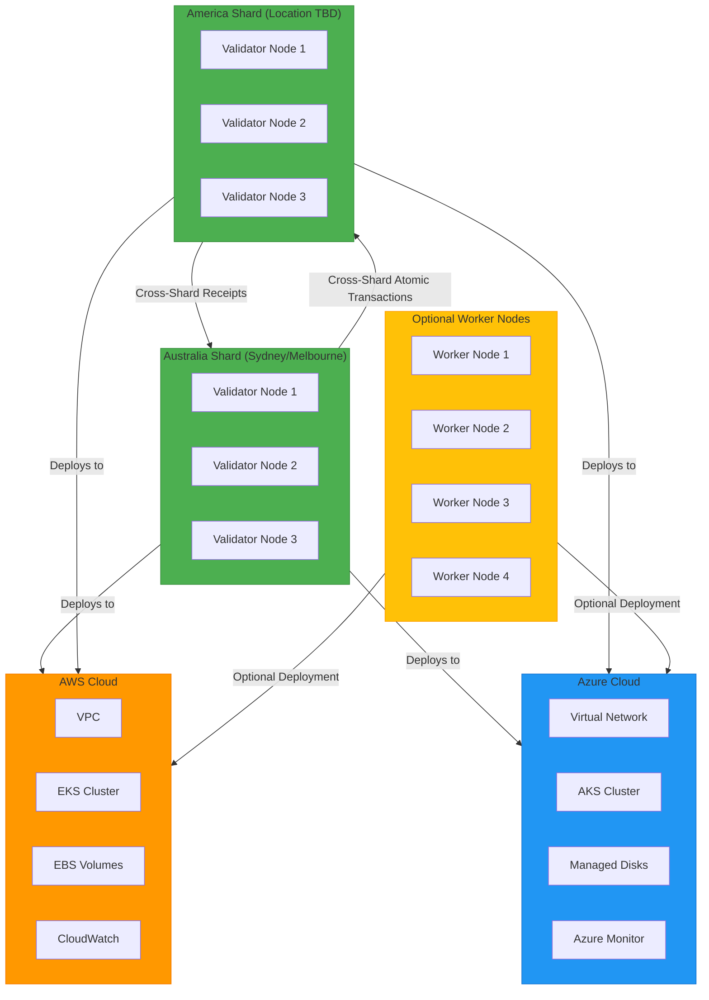

# OpenTofu Migration & Azure Deployment Plan

## Executive Summary

This plan outlines the migration from Terraform to OpenTofu and the creation of Azure-specific infrastructure configuration for the Chert blockchain network. The goal is to support multi-cloud deployment with 6 validator nodes distributed across Australia and America shards.

## Current Infrastructure Analysis

### Terraform Code Completeness
- **Status**: Production-ready, highly complete
- **Provider**: AWS-specific (uses `hashicorp/aws` provider)
- **Modules**: VPC, EKS, monitoring, security, storage
- **Variables**: 43 configurable parameters
- **Outputs**: 28 monitoring and integration outputs

### Sharding Architecture
- **Implementation**: Complete with atomic cross-shard execution
- **Performance**: 100K+ TPS per shard, 1M+ TPS globally
- **Geographic Distribution**: Regional shard assignment with compliance
- **Load Balancing**: Multiple strategies (Geographic, LoadBased, HotAccountAware)

## Migration Plan

### Phase 1: OpenTofu Migration (Current AWS Configuration)

**Objective**: Convert existing Terraform to OpenTofu syntax

**Tasks**:
1. ✅ **Provider Migration**: Replace `terraform` block with `tofu` block
2. ✅ **Module Compatibility**: Verify all modules work with OpenTofu
3. ✅ **State Migration**: Plan for Terraform state migration to OpenTofu
4. ✅ **Testing**: Validate OpenTofu configuration works identically

**Files to Modify**:
- `infrastructure/terraform/main.tf` → `infrastructure/opentofu/aws/main.tf`
- `infrastructure/terraform/variables.tf` → `infrastructure/opentofu/aws/variables.tf`
- `infrastructure/terraform/outputs.tf` → `infrastructure/opentofu/aws/outputs.tf`

### Phase 2: Azure Configuration Creation

**Objective**: Create Azure-specific OpenTofu configuration

**Tasks**:
1. **Provider Setup**: Configure Azure provider with authentication
2. **Resource Mapping**: Convert AWS resources to Azure equivalents
3. **Network Architecture**: Implement Azure Virtual Network with subnets
4. **Compute Resources**: Configure Azure Kubernetes Service (AKS)
5. **Storage**: Set up Azure Managed Disks
6. **Monitoring**: Configure Azure Monitor integration

**Files to Create**:
- `infrastructure/opentofu/azure/main.tf`
- `infrastructure/opentofu/azure/variables.tf`
- `infrastructure/opentofu/azure/outputs.tf`
- `infrastructure/opentofu/azure/modules/vnet/`

### Phase 3: Deployment Strategy

**Shard Configuration**:
- **Australia Shard**: 3 validator nodes (Sydney/Melbourne)
- **America Shard**: 3 validator nodes (Location TBD)
- **Worker Nodes**: 1-4 optional worker nodes for additional processing

**Node Types**:
- **Validator Nodes**: Full consensus participants (6 total)
- **Worker Nodes**: Optional processing nodes (1-4, configurable)

## Infrastructure Architecture



## Node Configuration Details

### Validator Nodes (6 total)
- **Australia Shard**: 3 nodes (Sydney/Melbourne)
- **America Shard**: 3 nodes (Location TBD)
- **Instance Type**: Standard_D4s_v3 (Azure equivalent of t3.medium)
- **Storage**: 100GB Premium SSD per node
- **Networking**: High availability across multiple availability zones

### Optional Worker Nodes (1-4)
- **Purpose**: Additional processing capacity
- **Configuration**: Same specifications as validator nodes
- **Deployment**: Flexible - can be deployed to either cloud or both

## Variables Configuration

### Required Variables Files

**AWS Variables (`aws.tfvars`)**:
```hcl
project_name        = "chert"
environment         = "testnet"
network_name        = "silica"
aws_region          = "ap-southeast-2" # Sydney
validator_node_count = 6
worker_node_count   = 2
node_instance_type  = "t3.medium"
node_storage_size   = 100
```

**Azure Variables (`azure.tfvars`)**:
```hcl
project_name        = "chert"
environment         = "testnet"
network_name        = "silica"
azure_region        = "australiaeast" # Sydney
validator_node_count = 6
worker_node_count   = 2
node_vm_size        = "Standard_D4s_v3"
node_disk_size      = 100
```

## Implementation Timeline

1. **Week 1**: OpenTofu migration of existing AWS Terraform
2. **Week 2**: Azure configuration creation and testing
3. **Week 3**: Multi-cloud deployment validation
4. **Week 4**: Performance testing and optimization

## Risk Assessment

**Low Risk**:
- OpenTofu migration (drop-in replacement)
- Variable configuration adjustments

**Medium Risk**:
- Azure resource mapping accuracy
- Cross-cloud consistency validation

**High Risk**:
- Cross-shard communication latency
- Geographic distribution synchronization

## Success Criteria

1. ✅ OpenTofu configuration works identically to Terraform
2. ✅ Azure deployment succeeds with 6 validator nodes
3. ✅ Cross-shard transactions complete within performance targets
4. ✅ Multi-cloud deployment maintains consistency
5. ✅ Optional worker nodes can be added/removed without downtime

## Next Steps

1. **Immediate**: Migrate existing Terraform to OpenTofu
2. **Parallel**: Create Azure-specific OpenTofu configuration
3. **Testing**: Validate both configurations in isolation
4. **Integration**: Test cross-cloud deployment scenarios
5. **Documentation**: Create deployment guides for both clouds